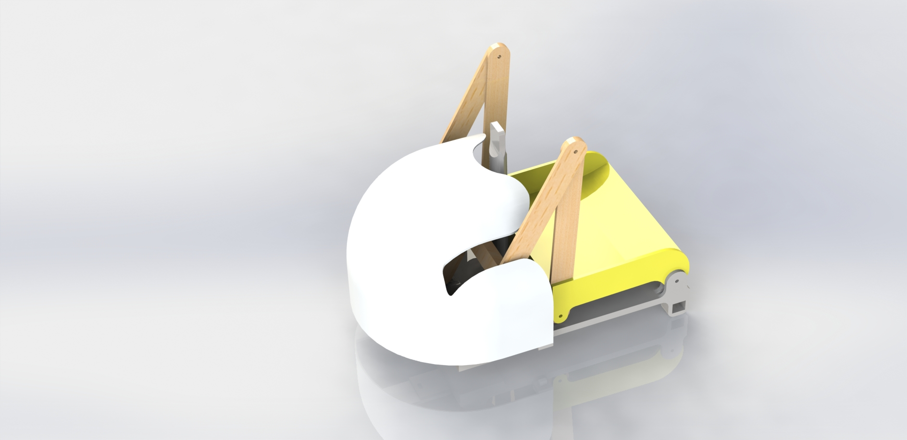
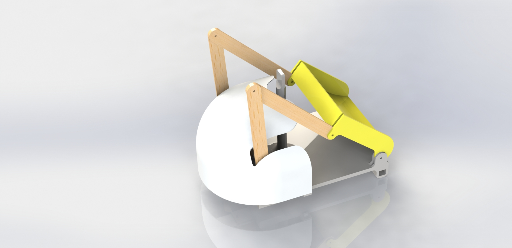
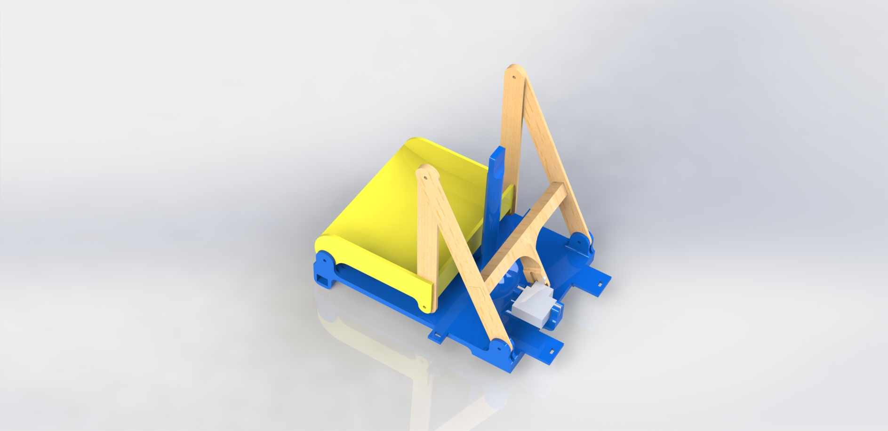
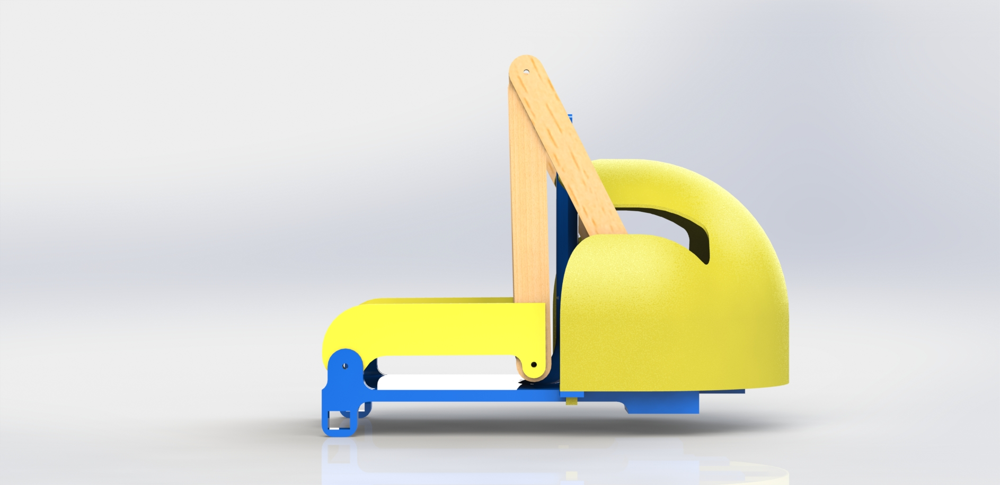
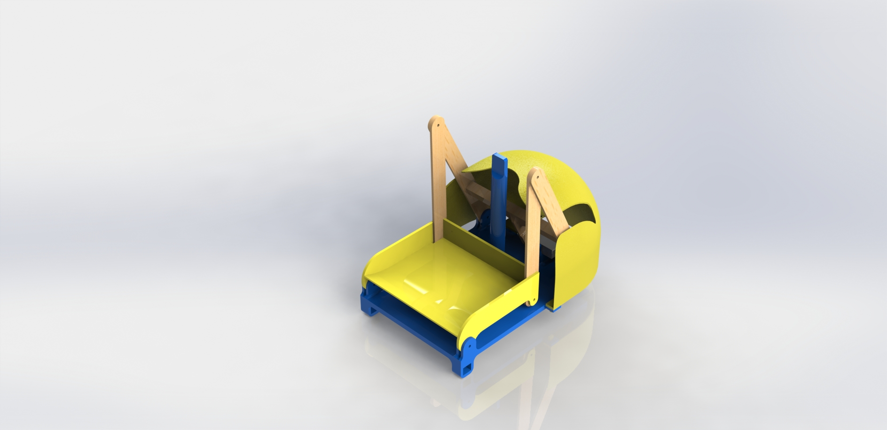

# ComputerVisionDumptruck
A computer vision dump-truck robot for IDDFA19 at Cornell Tech

## Team
Matt Freed and Bil Leon

Rough form:

## Expected parts:
2 Motors

Battery

Camera

Arduino

Google Coral

Servo

Mostly everything will be located under the hood. The camera will be located on the rod as seen in the renders

## Interaction plan:
People will put an object in the trunk of the truck, and a camera at the top of the truck will see it, and bring it to the right location, in which it will dump the object when it is in the right location
