# ComputerVisionDumptruck
A computer vision dump-truck robot for IDDFA19 at Cornell Tech

## Team
Matt Freed and Bil Leon

Rough form:
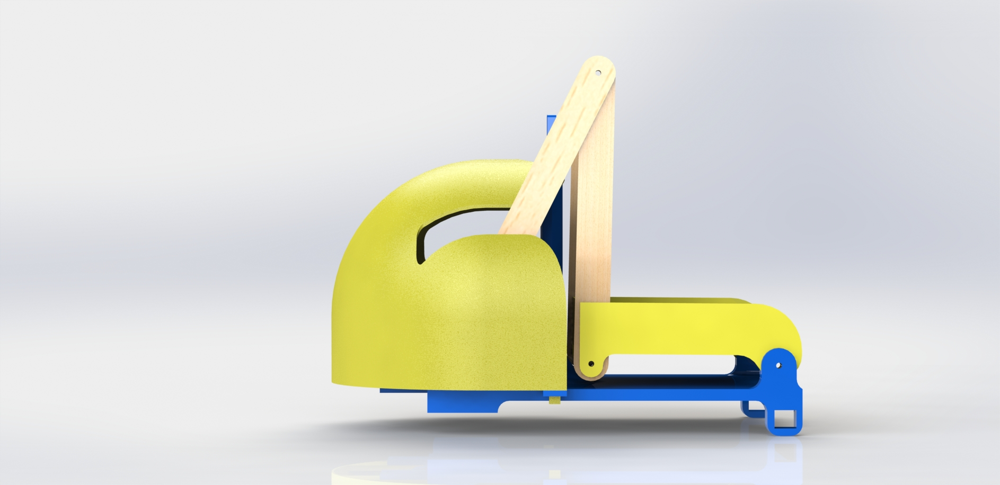
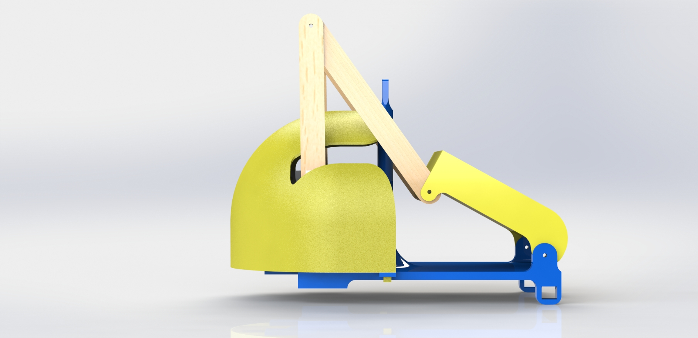
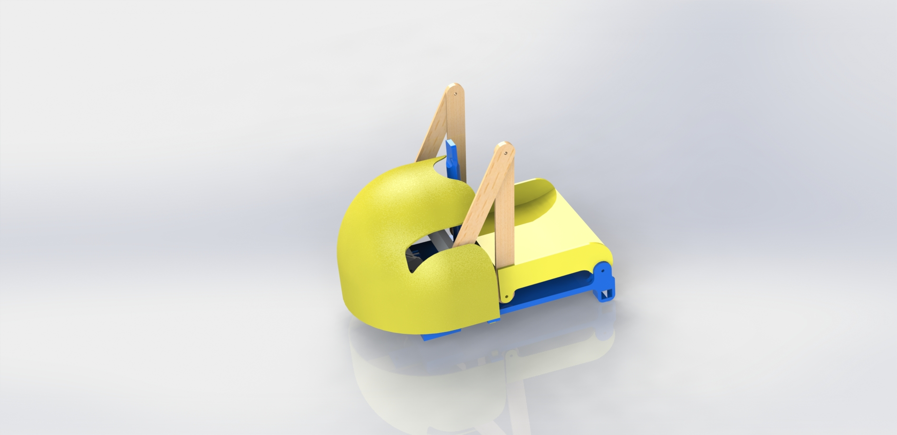
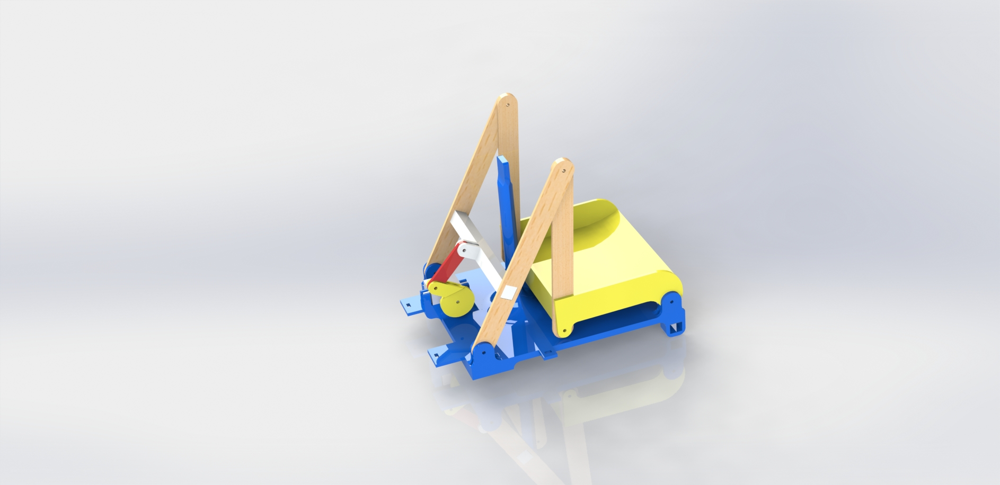
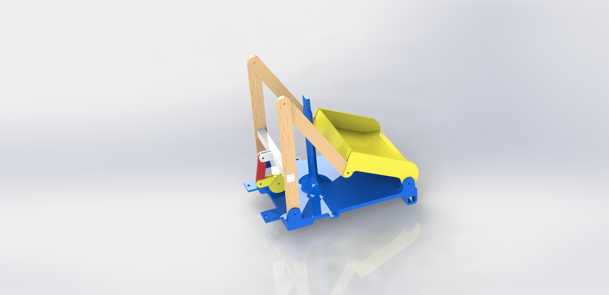
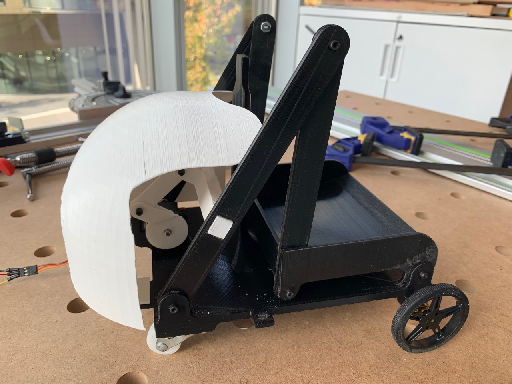
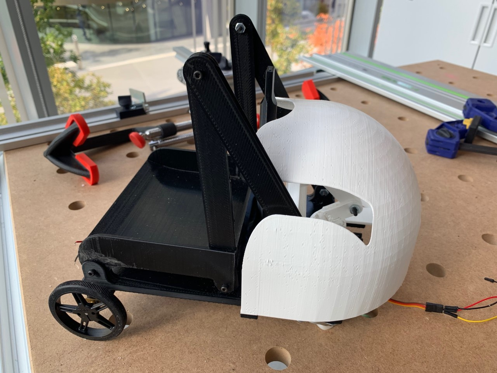
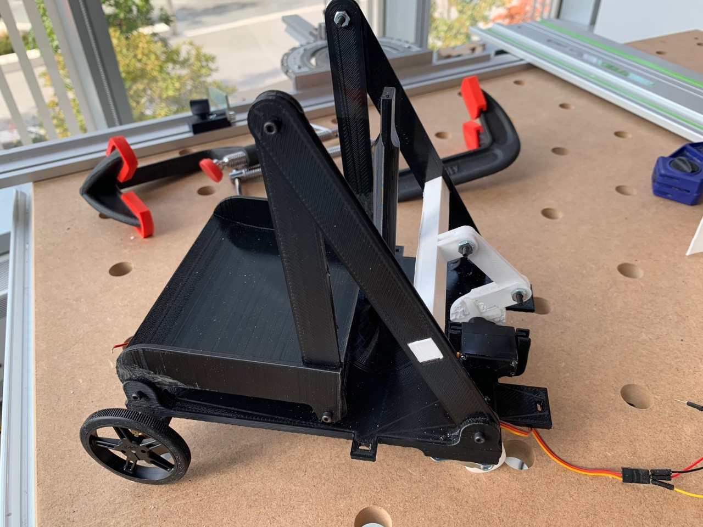
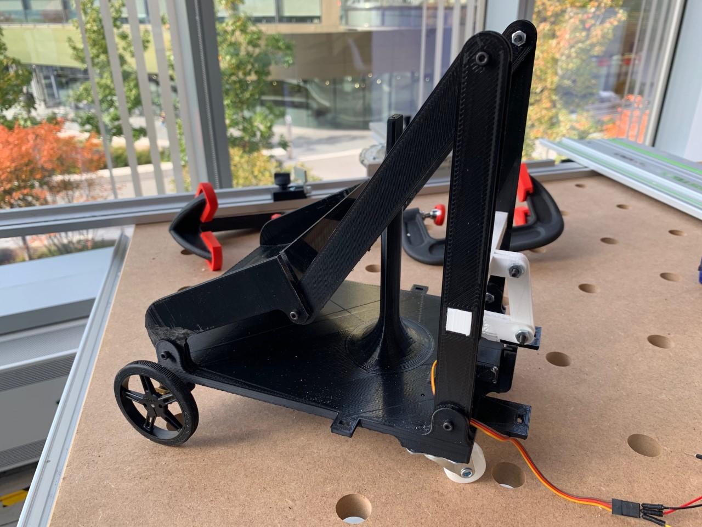
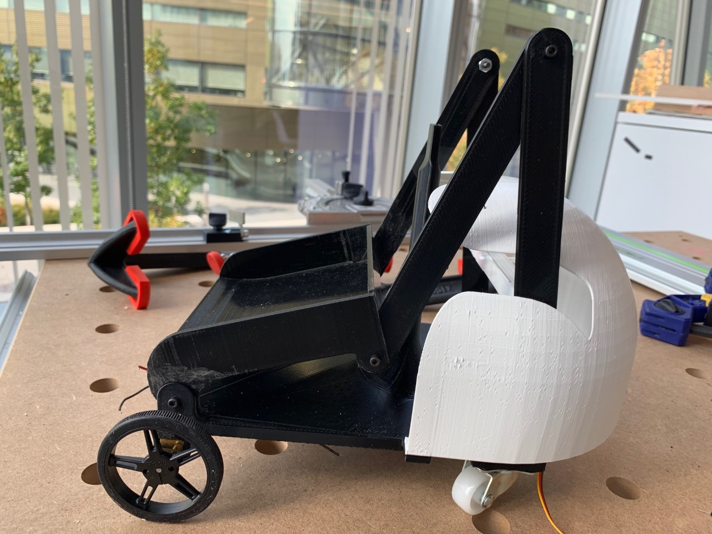
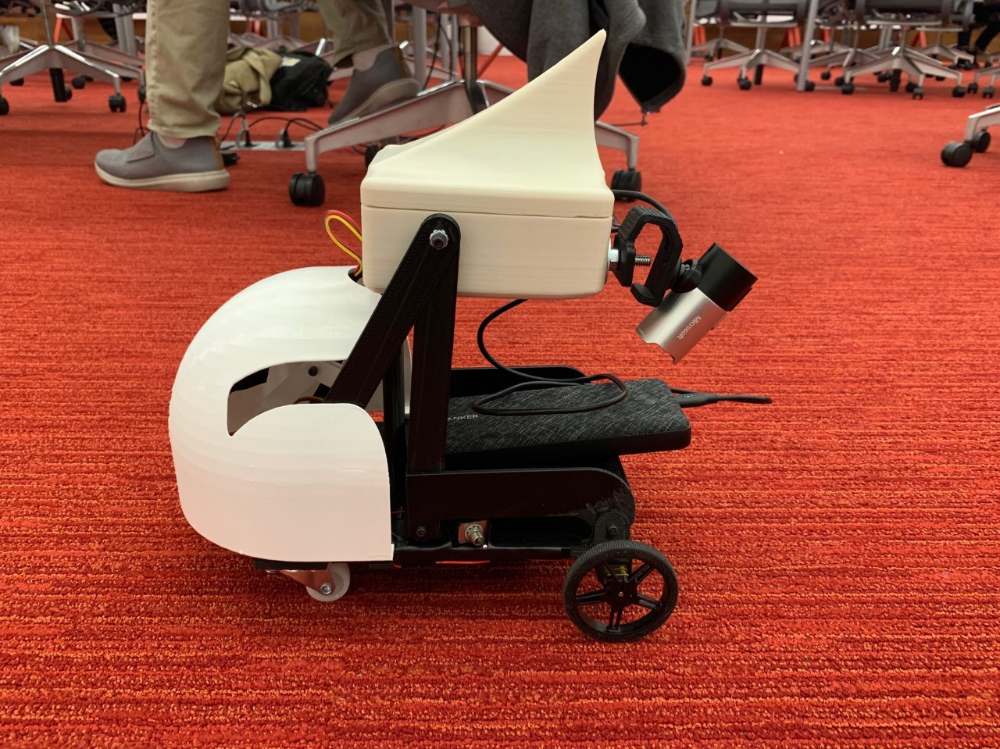

## Videos:
https://www.youtube.com/watch?v=ux81tY8T8iU

https://www.youtube.com/watch?v=gVR7a9DyGOU

https://www.youtube.com/watch?v=SawVYpYz-DI

## Expected parts:
2 Motors

Caster Wheels

Battery

Camera

2x Arduino

Arduino Motor Shield

RPI

Servo

Mostly everything will be located under the hood. The camera will be located on the rod as seen in the renders

## Interaction plan:

Shop bot is a workshop-helper. No more needing too put your tools in the right locations, simply put the tool into shop-bots basket and it will bring the tool to the right place!

## Step 1: Design

Download the cad files that are located in this repository. These parts were custom designed.

## Step 2: Manufacturing and assembly

These parts were designed to be 3d printed. 3D print the files and assemble them, referencing the render models for where each part goes. 3D printers are not exact when printing parts, and therefore the parts may need be sanded down to freely move depending on which 3D printer was used. 

Once all are attached, begin mounting the elctronics. The servo belongs in the front, and should frictiono fit in place in its locking location. The motors also should friction fit into place on the rear of the robot.

Screw 2 caster wheels to the front of the underside of the robot on the platforms supplied.

Attach the arduino with the motorshield to the underside of the robot, located near center. Connect the motors to the motor shield.

Once the entire robot is assembled, place the second arduino and the Pi into the electronics bay (the fin-like box).

Connect the servo wires to the arduino located inside the electronics bay.

Connect the two arduinos now to the Pi's usb ports, along with the camera usb.

## Step 3: Programming

Flash the servo arduino with the servo code and the motor arduino with the motor controller code. 

Flash the Pi with the supplied code for computer vision, this will tell the pi what is inside the dump bed, alonog with what servo to send information to.

## Step 4: Watch!

Turn the robot on and place a hot dog inside the bed! If done correctly, the robot should see the hot dog and know that it must go straight, then to the right, then dump the hotdog, and then return back to you!

Congrats you are now a robot wizard!

